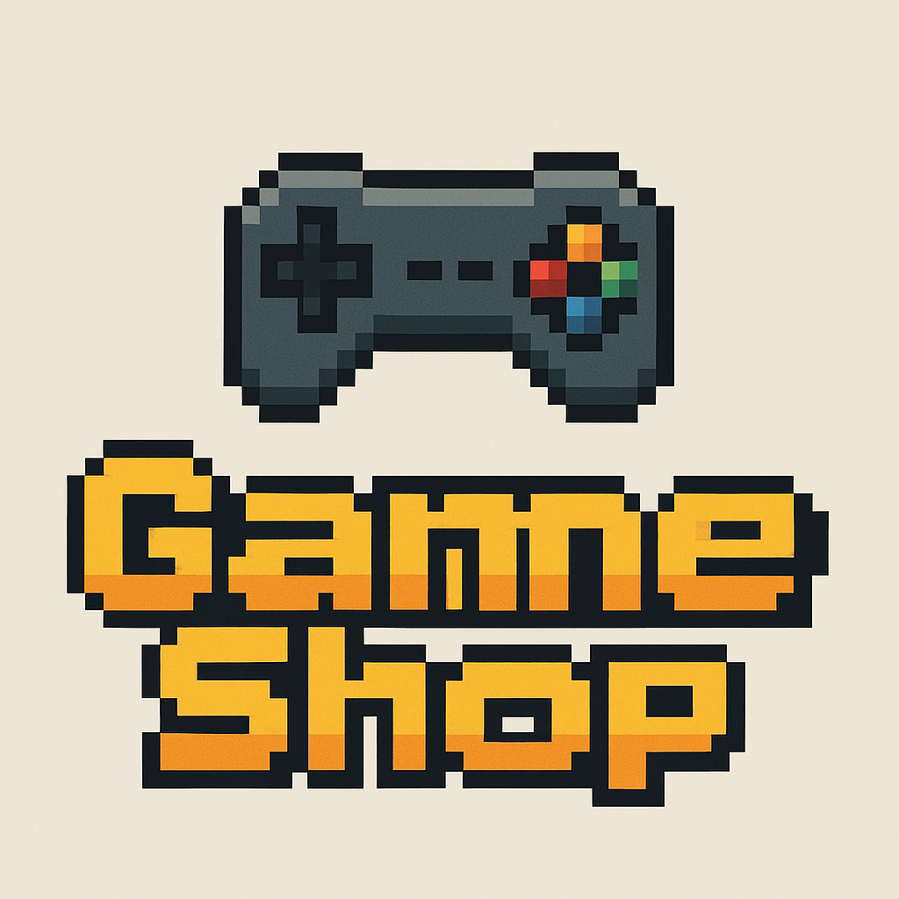

# GameShop - Tienda Online de Videojuegos



## Descripción del Proyecto

GameShop es una tienda en línea especializada en la venta de videojuegos, accesorios y tarjetas de regalo para diferentes plataformas. Esta aplicación web permite a los usuarios explorar catálogos, filtrar por categorías y plataformas, gestionar un carrito de compras, y completar el proceso de compra de manera intuitiva.

## Características Principales

- 🎮 Catálogo completo de videojuegos para diferentes plataformas
- 🎧 Sección de accesorios para gaming
- 💳 Venta de tarjetas de regalo digitales
- 🔍 Sistema de búsqueda y filtrado avanzado
- 🛒 Carrito de compras persistente
- 💰 Múltiples opciones de pago
- 👤 Gestión de cuentas de usuario
- 🌐 Soporte para múltiples monedas

## Tecnologías Utilizadas

### Frameworks y Librerías Principales

- **React**: Biblioteca JavaScript para construir interfaces de usuario.
- **Vite**: Herramienta de construcción que proporciona un entorno de desarrollo más rápido.
- **Firebase**: Plataforma de desarrollo de aplicaciones que proporciona:
  - **Firestore**: Base de datos NoSQL para almacenar productos, usuarios y órdenes.
  - **Authentication**: Sistema de autenticación para gestionar usuarios.
  - **Storage**: Almacenamiento de archivos para imágenes de productos.
- **React Router**: Navegación entre páginas en la aplicación de una sola página (SPA).
- **React Bootstrap**: Framework de UI basado en Bootstrap para React.
- **React-Toastify**: Biblioteca para mostrar notificaciones elegantes.

### Librerías Adicionales

- **Context API**: Sistema de gestión de estado para manejar el carrito, autenticación y preferencias de moneda.
- **Font Awesome**: Conjunto de iconos vectoriales y estilos CSS.
- **ESLint**: Herramienta de análisis de código estático para identificar patrones problemáticos.

## Conceptos Clave

### Slugs
Un "slug" es una versión amigable para URLs de un string, típicamente un título. Se utiliza en las rutas de la aplicación para identificar recursos específicos de manera legible. Por ejemplo, el juego "Grand Theft Auto V" tendría un slug como "grand-theft-auto-v".

### Firebase Collections
La aplicación utiliza colecciones en Firestore para organizar los datos:
- **games**: Almacena la información de todos los videojuegos.
- **categories**: Contiene categorías como "Acción", "Aventura", etc.
- **platforms**: Almacena plataformas como PlayStation, Xbox, PC, etc.
- **accessories**: Colección para los accesorios de gaming.
- **giftCards**: Contiene información sobre tarjetas de regalo disponibles.
- **users**: Almacena los datos de los usuarios registrados.
- **orders**: Guarda información sobre las órdenes realizadas.

### Hot Module Replacement (HMR)
Tecnología que permite actualizar módulos de JavaScript en tiempo real mientras la aplicación está en ejecución, sin necesidad de recargar la página completa. Esto acelera significativamente el proceso de desarrollo.

### Fast Refresh
Característica en React que preserva el estado de los componentes al editar sus archivos, proporcionando retroalimentación instantánea durante el desarrollo.

## Estructura del Proyecto

```
gameShop/
├── public/              # Archivos estáticos servidos directamente
├── src/                 # Código fuente
│   ├── assets/          # Imágenes, logos y recursos estáticos
│   ├── components/      # Componentes reutilizables
│   ├── contexts/        # Contextos de React (carrito, autenticación, moneda)
│   ├── firebase/        # Configuración y utilidades de Firebase
│   ├── layouts/         # Estructuras de diseño reutilizables
│   ├── pages/           # Componentes de página
│   │   ├── admin/       # Páginas del panel de administración
│   │   └── platforms/   # Páginas específicas de plataformas
│   └── styles/          # Archivos CSS y variables de estilo
└── index.html           # Punto de entrada HTML
```

## Instalación y Ejecución

Para instalar y ejecutar localmente el proyecto:

```bash
# Clonar el repositorio
git clone https://github.com/usuario/gameShop.git
cd gameShop

# Instalar dependencias
npm install

# Ejecutar el servidor de desarrollo
npm run dev

# Compilar para producción
npm run build
```

## Funcionalidades para el Administrador

El panel de administración permite:
- Gestionar productos (añadir, editar, eliminar)
- Administrar categorías y plataformas
- Ver y gestionar pedidos
- Monitorear inventario

## Licencia

Este proyecto está licenciado bajo la Licencia MIT - ver el archivo LICENSE.md para más detalles.

## Contacto

Para preguntas o soporte, contactar a: admin@gameshop.com
